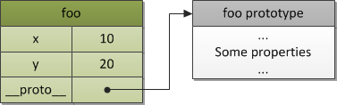
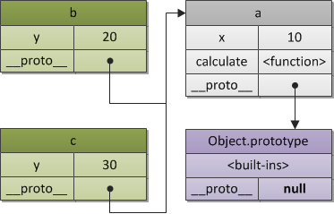

<Excerpt in index | 首页摘要> 
深入理解JavaScript系列（10）：JavaScript核心（晋级高手必读篇）
<!-- more -->
<The rest of contents | 余下全文>

-----
**本文转自**
http://www.cnblogs.com/TomXu/archive/2012/01/12/2308594.html

强烈建议你们支持原文汤姆大叔！！！

本篇是[ECMA-262-3 in detail](http://dmitrysoshnikov.com/tag/ecma-262-3/)系列的一个概述（本人后续会翻译整理这些文章到本系列（第11-19章）。每个章节都有一个更详细的内容链接，你可以继续读一下每个章节对应的详细内容链接进行更深入的了解。

适合的读者：有经验的开发员，专业前端人员。
```
原作者: Dmitry A. Soshnikov
发布时间: 2010-09-02
原文：http://dmitrysoshnikov.com/ecmascript/javascript-the-core/
参考1：http://ued.ctrip.com/blog/?p=2795
参考2：http://www.cnblogs.com/ifishing/archive/2010/12/08/1900594.html
主要是综合了上面2位高手的中文翻译，将两篇文章的精华部分都结合在一起了。
```
我们首先来看一下对象[Object]的概念，这也是ECMASript中最基本的概念。

### 1.对象Object


ECMAScript是一门高度抽象的面向对象(object-oriented)语言，用以处理Objects对象. 当然，也有基本类型，但是必要时，也需要转换成object对象来用。

```
An object is a collection of properties and has a single prototype object. The prototype may be either an object or the null value.

Object是一个属性的集合，并且都拥有一个单独的原型对象[prototype object]. 这个原型对象[prototype object]可以是一个object或者null值。
```
让我们来举一个基本Object的例子，首先我们要清楚，一个Object的prototype是一个内部的[[prototype]]属性的引用。

不过一般来说，我们会使用`__<内部属性名>__ `下划线来代替双括号，例如`__proto__`(这是某些脚本引擎比如SpiderMonkey的对于原型概念的具体实现，尽管并非标准)。
```javascript
var foo = {
  x: 10,
  y: 20
};
```
上述代码foo对象有两个显式的属性[explicit own properties]和一个自带隐式的 __proto__ 属性[implicit __proto__ property]，指向foo的原型。



图 1. 一个含有原型的基本对象

为什么需要原型呢，让我们考虑 原型链 的概念来回答这个问题。

### 2.原型链（Prototype chain）
原型对象也是普通的对象，并且也有可能有自己的原型，如果一个原型对象的原型不为null的话，我们就称之为原型链（prototype chain）。

```
A prototype chain is a finite chain of objects which is used to implemented inheritance and shared properties.
原型链是一个由对象组成的有限对象链由于实现继承和共享属性。
```
想象一个这种情况，2个对象，大部分内容都一样，只有一小部分不一样，很明显，在一个好的设计模式中，我们会需要重用那部分相同的，而不是在每个对象中重复定义那些相同的方法或者属性。在基于类[class-based]的系统中，这些重用部分被称为类的继承 – 相同的部分放入class A，然后class B和class C从A继承，并且可以声明拥有各自的独特的东西。

ECMAScript没有类的概念。但是，重用[reuse]这个理念没什么不同（某些方面，甚至比class-更加灵活），可以由prototype chain原型链来实现。这种继承被称为delegation based inheritance-基于继承的委托，或者更通俗一些，叫做原型继承。

类似于类”A”，”B”，”C”，在ECMAScript中尼创建对象类”a”，”b”，”c”，相应地， 对象“a” 拥有对象“b”和”c”的共同部分。同时对象“b”和”c”只包含它们自己的附加属性或方法。
```javascript
var a = {
  x: 10,
  calculate: function (z) {
    return this.x + this.y + z
  }
};
 
var b = {
  y: 20,
  __proto__: a
};
 
var c = {
  y: 30,
  __proto__: a
};
 
// 调用继承过来的方法
b.calculate(30); // 60
c.calculate(40); // 80
```
这样看上去是不是很简单啦。b和c可以使用a中定义的calculate方法，这就是有原型链来[prototype chain]实现的。

原理很简单:如果在对象b中找不到calculate方法(也就是对象b中没有这个calculate属性), 那么就会沿着原型链开始找。如果这个calculate方法在b的prototype中没有找到，那么就会沿着原型链找到a的prototype，一直遍历完整个原型链。记住，一旦找到，就返回第一个找到的属性或者方法。因此，第一个找到的属性成为继承属性。如果遍历完整个原型链，仍然没有找到，那么就会返回undefined。

注意一点，this这个值在一个继承机制中，仍然是指向它原本属于的对象，而不是从原型链上找到它时，它所属于的对象。例如，以上的例子，this.y是从b和c中获取的，而不是a。当然，你也发现了this.x是从a取的，因为是通过原型链机制找到的。

如果一个对象的prototype没有显示的声明过或定义过，那么__prototype__的默认值就是object.prototype, 而object.prototype也会有一个__prototype__, 这个就是原型链的终点了，被设置为null。

下面的图示就是表示了上述a,b,c的继承关系



图 2. 原型链

原型链通常将会在这样的情况下使用：对象拥有 相同或相似的状态结构(same or similar state structure) （即相同的属性集合）与 不同的状态值(different state values)。在这种情况下，我们可以使用 构造函数(Constructor) 在 特定模式(specified pattern) 下创建对象。

### 3.构造函数(Constructor)
除了创建对象，构造函数(constructor) 还做了另一件有用的事情—自动为创建的新对象设置了原型对象(prototype object) 。原型对象存放于 ConstructorFunction.prototype 属性中。

例如，我们重写之前例子，使用构造函数创建对象“b”和“c”，那么对象”a”则扮演了“Foo.prototype”这个角色：


除了创建对象，构造函数(constructor) 还做了另一件有用的事情—自动为创建的新对象设置了原型对象(prototype object) 。原型对象存放于 ConstructorFunction.prototype 属性中。

例如，我们重写之前例子，使用构造函数创建对象“b”和“c”，那么对象”a”则扮演了“Foo.prototype”这个角色：

```javascript
// 构造函数
function Foo(y) {
  // 构造函数将会以特定模式创建对象：被创建的对象都会有"y"属性
  this.y = y;
}
 
// "Foo.prototype"存放了新建对象的原型引用
// 所以我们可以将之用于定义继承和共享属性或方法
// 所以，和上例一样，我们有了如下代码：
 
// 继承属性"x"
Foo.prototype.x = 10;
 
// 继承方法"calculate"
Foo.prototype.calculate = function (z) {
  return this.x + this.y + z;
};
 
// 使用foo模式创建 "b" and "c"
var b = new Foo(20);
var c = new Foo(30);
 
// 调用继承的方法
b.calculate(30); // 60
c.calculate(40); // 80
 
// 让我们看看是否使用了预期的属性
 
console.log(
 
  b.__proto__ === Foo.prototype, // true
  c.__proto__ === Foo.prototype, // true
 
  // "Foo.prototype"自动创建了一个特殊的属性"constructor"
  // 指向a的构造函数本身
  // 实例"b"和"c"可以通过授权找到它并用以检测自己的构造函数
 
  b.constructor === Foo, // true
  c.constructor === Foo, // true
  Foo.prototype.constructor === Foo // true
 
  b.calculate === b.__proto__.calculate, // true
  b.__proto__.calculate === Foo.prototype.calculate // true
 
);
```
上述代码可表示为如下的关系：


图 3. 构造函数与对象之间的关系

上述图示可以看出，每一个object都有一个prototype. 构造函数Foo也拥有自己的__proto__, 也就是Function.prototype, 而Function.prototype的__proto__指向了Object.prototype. 重申一遍，Foo.prototype只是一个显式的属性，也就是b和c的__proto__属性。

这个问题完整和详细的解释可以在大叔即将翻译的第18、19两章找到。有两个部分：面向对象编程.一般理论(OOP. The general theory)，描述了不同的面向对象的范式与风格(OOP paradigms and stylistics)，以及与ECMAScript的比较, 面向对象编程.ECMAScript实现(OOP. ECMAScript implementation), 专门讲述了ECMAScript中的面向对象编程。

现在，我们已经了解了基本的object原理，那么我们接下去来看看ECMAScript里面的程序执行环境[runtime program execution]. 这就是通常称为的“执行上下文堆栈”[execution context stack]。每一个元素都可以抽象的理解为object。你也许发现了，没错，在ECMAScript中，几乎处处都能看到object的身影。

### 4.执行上下文栈(Execution Context Stack)
在ECMASscript中的代码有三种类型：global, function和eval。

每一种代码的执行都需要依赖自身的上下文。当然global的上下文可能涵盖了很多的function和eval的实例。函数的每一次调用，都会进入函数执行中的上下文,并且来计算函数中变量等的值。eval函数的每一次执行，也会进入eval执行中的上下文，判断应该从何处获取变量的值。

注意，一个function可能产生无限的上下文环境，因为一个函数的调用（甚至递归）都产生了一个新的上下文环境。

```javascript
function foo(bar) {}

// 调用相同的function，每次都会产生3个不同的上下文
//（包含不同的状态，例如参数bar的值）

foo(10);
foo(20);
foo(30);
```
