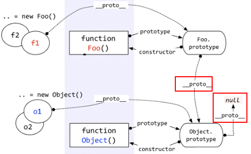
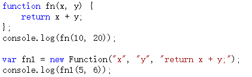
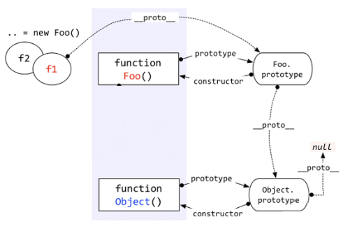

<Excerpt in index | 首页摘要> 
深入理解javascript原型和闭包
<!-- more -->
<The rest of contents | 余下全文>

-----
深入理解javascript原型和闭包（1）——一切都是对象
---javascript
### 1.typeof
typeof 输出的几种类型
```
function show(x) {

            console.log(typeof x);    // undefined
            console.log(typeof 10);   // number
            console.log(typeof 'abc'); // string
            console.log(typeof true);  // boolean

            console.log(typeof function () {});  //function

            console.log(typeof [1, 'a', true]);  //object
            console.log(typeof { a: 10, b: 20 });  //object
            console.log(typeof null);  //object
            console.log(typeof new Number(10));  //object
        }
        show();
```
以上代码列出了typeof输出的集中类型标识，其中上面的四种（undefined, number, string, boolean）属于简单的值类型，不是对象。剩下的几种情况——函数、数组、对象、null、new Number(10)都是对象。他们都是引用类型。

判断一个变量是不是对象非常简单。值类型的类型判断用typeof，引用类型的类型判断用instanceof。

### 2.instanceof
```javascript
var fn = function () { };
console.log(fn instanceof Object);  // true
```


### 3.对象——若干属性的集合。
```javascript
var fn = function () {
            alert(100);
        };
        fn.a = 10;
        fn.b = function () {
            alert(123);
        };
        fn.c = {
            name: "王福朋",
            year: 1988
        };
```
深入理解javascript原型和闭包（2）——函数和对象的关系
----

### 1.函数是一种对象
```
var fn = function () { };
console.log(fn instanceof Object);  // true
```
对！函数是一种对象，但是函数却不像数组一样——你可以说数组是对象的一种，因为数组就像是对象的一个子集一样。但是函数与对象之间，却不仅仅是一种包含和被包含的关系，函数和对象之间的关系比较复杂，甚至有一点鸡生蛋蛋生鸡的逻辑，咱们这一节就缕一缕。

### 2.对象可以通过函数来创建
```javascript
        function Fn() {
            this.name = '王福朋';
            this.year = 1988;
        }
        var fn1 = new Fn();
```
上面的这个例子很简单，它能说明：对象可以通过函数来创建。对！也只能说明这一点。

但是我要说——对象都是通过函数创建的——有些人可能反驳：不对！因为：

```javascript
var obj = { a: 10, b: 20 };
var arr = [5, 'x', true];
```

但是不好意思，这个——真的——是一种——“快捷方式”，在编程语言中，一般叫做“语法糖”。

做“语法糖”做的最好的可谓是微软大哥，它把他们家C#那小子弄的不男不女从的，本想图个人见人爱，谁承想还得到处跟人解释——其实它是个男孩！

话归正传——其实以上代码的本质是：

```javascript
//var obj = { a: 10, b: 20 };
        //var arr = [5, 'x', true];

        var obj = new Object();
        obj.a = 10;
        obj.b = 20;

        var arr = new Array();
        arr[0] = 5;
        arr[1] = 'x';
        arr[2] = true;
```
而其中的 Object 和 Array 都是函数：

```javascript
console.log(typeof (Object));  // function
console.log(typeof (Array));  // function
```

所以，可以很负责任的说——对象都是通过函数来创建的。

深入理解javascript原型和闭包（3）——prototype原型
----
### 1.prototype
每个函数都有一个属性叫做prototype。这个prototype的属性值是一个对象（属性的集合，再次强调！），默认的只有一个叫做constructor的属性，指向这个函数本身。


原型既然作为对象，属性的集合，不可能就只弄个constructor来玩玩，肯定可以自定义的增加许多属性。例如这位Object大哥，人家的prototype里面，就有好几个其他属性。


**可以在自己自定义的方法的prototype中新增自己的属性**
```
        function Fn() { }
        Fn.prototype.name = '王福朋';
        Fn.prototype.getYear = function () {
            return 1988;
        };
```


但是，这样做有何用呢？
```
function Fn() { }
        Fn.prototype.name = '王福朋';
        Fn.prototype.getYear = function () {
            return 1988;
        };

        var fn = new Fn();
        console.log(fn.name);
        console.log(fn.getYear());
```
即，Fn是一个函数，fn对象是从Fn函数new出来的，这样fn对象就可以调用Fn.prototype中的属性。

因为每个对象都有一个隐藏的属性——“__proto__”，这个属性引用了创建这个对象的函数的prototype。即：fn.__proto__ === Fn.prototype

这里的"__proto__"成为“隐式原型”

深入理解javascript原型和闭包（4）——隐式原型
----
好好看看http://www.cnblogs.com/wangfupeng1988/p/3979290.html

每个函数function都有一个prototype，即原型。这里再加一句话——每个对象都有一个__proto__，可成为隐式原型。

这个__proto__是一个隐藏的属性，javascript不希望开发者用到这个属性值，有的低版本浏览器甚至不支持这个属性值。所以你在Visual Studio 2012这样很高级很智能的编辑器中，都不会有__proto__的智能提示，但是你不用管它，直接写出来就是了。

```
var obj={};
console.log(obj.__proto__);
```


上面截图看来，obj.__proto__和Object.prototype的属性一样！这么巧！

答案就是一样。

obj这个对象本质上是被Object函数创建的，因此obj.__proto__=== Object.prototype。我们可以用一个图来表示。

**即，每个对象都有一个__proto__属性，指向创建该对象的函数的prototype。**
好问题！

在说明“Object prototype”之前，先说一下自定义函数的prototype。**自定义函数（构造函数）的prototype本质上就是和 var obj = {} 是一样的，都是被Object创建，所以它的__proto__指向的就是Object.prototype。**

**但是Object.prototype确实一个特例——它的__proto__指向的是null，切记切记！**



还有——函数也是一种对象，函数也有__proto__吗？

又一个好问题！——当然有。

函数也不是从石头缝里蹦出来的，函数也是被创建出来的。谁创建了函数呢？——Function——注意这个大写的“F”。

且看如下代码。


以上代码中，第一种方式是比较传统的函数创建方式，第二种是用new Functoin创建。
**首先根本不推荐用第二种方式。**

这里只是向大家演示，函数是被Function创建的。

好了，根据上面说的一句话——对象的__proto__指向的是创建它的函数的prototype，就会出现：`Object.__proto__ === Function.prototype.`用一个图来表示。


上图中，很明显的标出了：自定义函数Foo.__proto__指向Function.prototype，Object.__proto__指向Function.prototype，唉，怎么还有一个……Function.__proto__指向Function.prototype？这不成了循环引用了？

对！是一个环形结构。

其实稍微想一下就明白了。Function也是一个函数，函数是一种对象，也有__proto__属性。既然是函数，那么它一定是被Function创建。所以——Function是被自身创建的。所以它的__proto__指向了自身的Prototype。

最后一个问题：Function.prototype指向的对象，它的__proto__是不是也指向Object.prototype？

答案是肯定的。因为Function.prototype指向的对象也是一个普通的被Object创建的对象，所以也遵循基本的规则。


深入理解javascript原型和闭包（5）——instanceof
----
对于值类型，你可以通过typeof判断，string/number/boolean都很清楚，但是typeof在判断到引用类型的时候，返回值只有object/function，你不知道它到底是一个object对象，还是数组，还是new Number等等。

这个时候就需要用到instanceof。例如：


上图中，f1这个对象是被Foo创建，但是“f1 instanceof Object”为什么是true呢？

 

至于为什么过会儿再说，先把instanceof判断的规则告诉大家。根据以上代码看下图：


Instanceof运算符的第一个变量是一个对象，暂时称为A；第二个变量一般是一个函数，暂时称为B。

Instanceof的判断队则是：**沿着A的__proto__这条线来找，同时沿着B的prototype这条线来找，如果两条线能找到同一个引用，即同一个对象，那么就返回true。如果找到终点还未重合，则返回false。**

按照以上规则，大家看看“ f1 instanceof Object ”这句代码是不是true？ 根据上图很容易就能看出来，就是true。


通过上以规则，你可以解释很多比较怪异的现象，例如：


这些看似很混乱的东西，答案却都是true，这是为何？

正好，这里也接上了咱们上一节说的“乱”。

上一节咱们贴了好多的图片，其实那些图片是可以联合成一个整体的，即：


看这个图片，千万不要嫌烦，必须一条线一条线挨着分析。如果上一节你看的比较仔细，再结合刚才咱们介绍的instanceof的概念，相信能看懂这个图片的内容。

看看这个图片，你也就知道为何上面三个看似混乱的语句返回的是true了。

 

问题又出来了。Instanceof这样设计，到底有什么用？到底instanceof想表达什么呢？

重点就这样被这位老朋友给引出来了**继承——原型链。**

即，**instanceof表示的就是一种继承关系，或者原型链的结构。**

深入理解javascript原型和闭包（6）——继承
---

为何用“继承”为标题，而不用“原型链”？

原型链如果解释清楚了很容易理解，不会与常用的java/C#产生混淆。而“继承”确实常用面向对象语言中最基本的概念，但是java中的继承与javascript中的继承又完全是两回事儿。因此，这里把“继承”着重拿出来，就为了体现这个不同。

 
javascript中的继承是通过原型链来体现的。先看几句代码


以上代码中，f1是Foo函数new出来的对象，f1.a是f1对象的基本属性，f1.b是怎么来的呢？——从Foo.prototype得来，因为f1.__proto__指向的是Foo.prototype

**访问一个对象的属性时，先在基本属性中查找，如果没有，再沿着__proto__这条链向上找，这就是原型链。**

看图说话：

上图中，访问f1.b时，f1的基本属性中没有b，于是沿着__proto__找到了Foo.prototype.b。

那么我们在实际应用中如何区分一个属性到底是基本的还是从原型中找到的呢？大家可能都知道答案了——hasOwnProperty，特别是在for…in…循环中，一定要注意。


等等，不对！ f1的这个hasOwnProperty方法是从哪里来的？ f1本身没有，Foo.prototype中也没有，哪儿来的？

好问题。

它是从Object.prototype中来的，请看图：


对象的原型链是沿着__proto__这条线走的，因此在查找f1.hasOwnProperty属性时，就会顺着原型链一直查找到Object.prototype。

 

由于所有的对象的原型链都会找到Object.prototype，因此所有的对象都会有Object.prototype的方法。这就是所谓的“继承”。

当然这只是一个例子，你可以自定义函数和对象来实现自己的继承。

 

说一个函数的例子吧。

我们都知道每个函数都有call，apply方法，都有length，arguments，caller等属性。为什么每个函数都有？这肯定是“继承”的。函数由Function函数创建，因此继承的Function.prototype中的方法。不信可以请微软的Visual Studio老师给我们验证一下：


看到了吧，有call、length等这些属性。

那怎么还有hasOwnProperty呢？——那是Function.prototype继承自Object.prototype的方法。有疑问可以看看上一节将instanceof时候那个大图，看看Function.prototype.__proto__是否指向Object.prototype。

 

原型、原型链，大家都明白了吗？

深入理解javascript原型和闭包（7）——原型的灵活性
----

首先，对象属性可以随时改动。

对象或者函数，刚开始new出来之后，可能啥属性都没有。但是你可以这会儿加一个，过一会儿在加两个，非常灵活。

在jQuery的源码中，对象被创建时什么属性都没有，都是代码一步一步执行时，一个一个加上的。


其次，如果继承的方法不合适，可以做出修改。


如上图，Object和Array的toString()方法不一样。肯定是Array.prototype.toString()方法做了修改。

同理，我也可以自定义一个函数，并自己去修改prototype.toString()方法。


最后，如果感觉当前缺少你要用的方法，可以自己去创建。

例如在json2.js源码中，为Date、String、Number、Boolean方法添加一个toJSON的属性。


如果你要添加内置方法的原型属性，最好做一步判断，如果该属性不存在，则添加。如果本来就存在，就没必要再添加了。

深入理解javascript原型和闭包（8）——简述【执行上下文】上
---
什么是“执行上下文”（也叫做“执行上下文环境”）？暂且不下定义，先看一段代码：


第一句报错，a未定义，很正常。第二句、第三句输出都是undefined，说明浏览器在执行console.log(a)时，已经知道了a是undefined，但却不知道a是10（第三句中）。

在一段js代码拿过来真正一句一句运行之前，浏览器已经做了一些“准备工作”，其中就包括对变量的声明，而不是赋值。变量赋值是在赋值语句执行的时候进行的。可用下图模拟：


这是第一种情况。

 

下面还有。先来个简单的。


有js开发经验的朋友应该都知道，你无论在哪个位置获取this，都是有值的。至于this的取值情况，比较复杂，会专门拿出一篇文章来讲解。

与第一种情况不同的是：第一种情况只是对变量进行声明（并没有赋值），而此种情况直接给this赋值。这也是“准备工作”情况要做的事情之一。

下面还有。。。第三种情况。

在第三种情况中，需要注意代码注释中的两个名词——**“函数表达式”和“函数声明”**。虽然两者都很常用，但是这两者在“准备工作”时，却是两种待遇。

