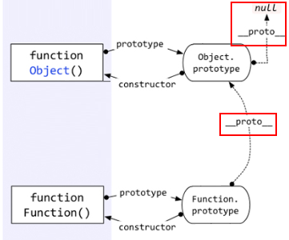
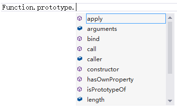
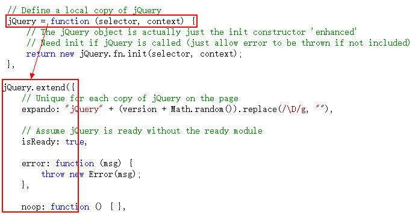
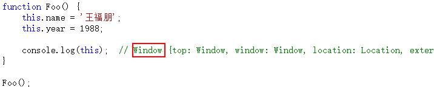
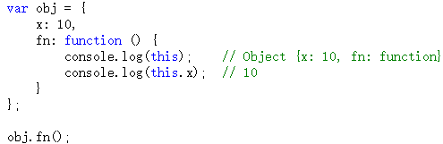
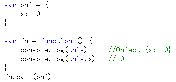
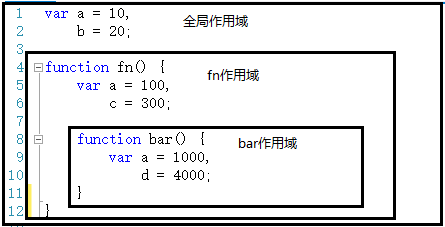
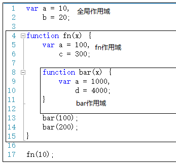
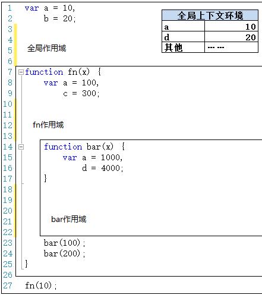

<Excerpt in index | 首页摘要> 
深入理解javascript原型和闭包
<!-- more -->
<The rest of contents | 余下全文>

-----
深入理解javascript原型和闭包（1）——一切都是对象
---javascript
### 1.typeof
typeof 输出的几种类型
```
function show(x) {

            console.log(typeof x);    // undefined
            console.log(typeof 10);   // number
            console.log(typeof 'abc'); // string
            console.log(typeof true);  // boolean

            console.log(typeof function () {});  //function

            console.log(typeof [1, 'a', true]);  //object
            console.log(typeof { a: 10, b: 20 });  //object
            console.log(typeof null);  //object
            console.log(typeof new Number(10));  //object
        }
        show();
```
以上代码列出了typeof输出的集中类型标识，其中上面的四种（undefined, number, string, boolean）属于简单的值类型，不是对象。剩下的几种情况——函数、数组、对象、null、new Number(10)都是对象。他们都是引用类型。

判断一个变量是不是对象非常简单。值类型的类型判断用typeof，引用类型的类型判断用instanceof。

### 2.instanceof
```javascript
var fn = function () { };
console.log(fn instanceof Object);  // true
```


### 3.对象——若干属性的集合。
```javascript
var fn = function () {
            alert(100);
        };
        fn.a = 10;
        fn.b = function () {
            alert(123);
        };
        fn.c = {
            name: "王福朋",
            year: 1988
        };
```
深入理解javascript原型和闭包（2）——函数和对象的关系
----

### 1.函数是一种对象
```
var fn = function () { };
console.log(fn instanceof Object);  // true
```
对！函数是一种对象，但是函数却不像数组一样——你可以说数组是对象的一种，因为数组就像是对象的一个子集一样。但是函数与对象之间，却不仅仅是一种包含和被包含的关系，函数和对象之间的关系比较复杂，甚至有一点鸡生蛋蛋生鸡的逻辑，咱们这一节就缕一缕。

### 2.对象可以通过函数来创建
```javascript
        function Fn() {
            this.name = '王福朋';
            this.year = 1988;
        }
        var fn1 = new Fn();
```
上面的这个例子很简单，它能说明：对象可以通过函数来创建。对！也只能说明这一点。

但是我要说——对象都是通过函数创建的——有些人可能反驳：不对！因为：

```javascript
var obj = { a: 10, b: 20 };
var arr = [5, 'x', true];
```

但是不好意思，这个——真的——是一种——“快捷方式”，在编程语言中，一般叫做“语法糖”。

做“语法糖”做的最好的可谓是微软大哥，它把他们家C#那小子弄的不男不女从的，本想图个人见人爱，谁承想还得到处跟人解释——其实它是个男孩！

话归正传——其实以上代码的本质是：

```javascript
//var obj = { a: 10, b: 20 };
        //var arr = [5, 'x', true];

        var obj = new Object();
        obj.a = 10;
        obj.b = 20;

        var arr = new Array();
        arr[0] = 5;
        arr[1] = 'x';
        arr[2] = true;
```
而其中的 Object 和 Array 都是函数：

```javascript
console.log(typeof (Object));  // function
console.log(typeof (Array));  // function
```

所以，可以很负责任的说——对象都是通过函数来创建的。

深入理解javascript原型和闭包（3）——prototype原型
----
### 1.prototype
每个函数都有一个属性叫做prototype。这个prototype的属性值是一个对象（属性的集合，再次强调！），默认的只有一个叫做constructor的属性，指向这个函数本身。


原型既然作为对象，属性的集合，不可能就只弄个constructor来玩玩，肯定可以自定义的增加许多属性。例如这位Object大哥，人家的prototype里面，就有好几个其他属性。


**可以在自己自定义的方法的prototype中新增自己的属性**
```
        function Fn() { }
        Fn.prototype.name = '王福朋';
        Fn.prototype.getYear = function () {
            return 1988;
        };
```


但是，这样做有何用呢？
```
function Fn() { }
        Fn.prototype.name = '王福朋';
        Fn.prototype.getYear = function () {
            return 1988;
        };

        var fn = new Fn();
        console.log(fn.name);
        console.log(fn.getYear());
```
即，Fn是一个函数，fn对象是从Fn函数new出来的，这样fn对象就可以调用Fn.prototype中的属性。

因为每个对象都有一个隐藏的属性——“__proto__”，这个属性引用了创建这个对象的函数的prototype。即：fn.__proto__ === Fn.prototype

这里的"__proto__"成为“隐式原型”

深入理解javascript原型和闭包（4）——隐式原型
----
好好看看http://www.cnblogs.com/wangfupeng1988/p/3979290.html

每个函数function都有一个prototype，即原型。这里再加一句话——每个对象都有一个__proto__，可成为隐式原型。

这个__proto__是一个隐藏的属性，javascript不希望开发者用到这个属性值，有的低版本浏览器甚至不支持这个属性值。所以你在Visual Studio 2012这样很高级很智能的编辑器中，都不会有__proto__的智能提示，但是你不用管它，直接写出来就是了。

```
var obj={};
console.log(obj.__proto__);
```


上面截图看来，obj.__proto__和Object.prototype的属性一样！这么巧！

答案就是一样。

obj这个对象本质上是被Object函数创建的，因此obj.__proto__=== Object.prototype。我们可以用一个图来表示。

**即，每个对象都有一个__proto__属性，指向创建该对象的函数的prototype。**
好问题！

在说明“Object prototype”之前，先说一下自定义函数的prototype。**自定义函数（构造函数）的prototype本质上就是和 var obj = {} 是一样的，都是被Object创建，所以它的__proto__指向的就是Object.prototype。**

**但是Object.prototype确实一个特例——它的__proto__指向的是null，切记切记！**


还有——函数也是一种对象，函数也有__proto__吗？

又一个好问题！——当然有。

函数也不是从石头缝里蹦出来的，函数也是被创建出来的。谁创建了函数呢？——Function——注意这个大写的“F”。

且看如下代码。


以上代码中，第一种方式是比较传统的函数创建方式，第二种是用new Functoin创建。
**首先根本不推荐用第二种方式。**

这里只是向大家演示，函数是被Function创建的。

好了，根据上面说的一句话——对象的__proto__指向的是创建它的函数的prototype，就会出现：`Object.__proto__ === Function.prototype.`用一个图来表示。


上图中，很明显的标出了：自定义函数Foo.__proto__指向Function.prototype，Object.__proto__指向Function.prototype，唉，怎么还有一个……Function.__proto__指向Function.prototype？这不成了循环引用了？

对！是一个环形结构。

其实稍微想一下就明白了。Function也是一个函数，函数是一种对象，也有__proto__属性。既然是函数，那么它一定是被Function创建。所以——Function是被自身创建的。所以它的__proto__指向了自身的Prototype。

最后一个问题：Function.prototype指向的对象，它的__proto__是不是也指向Object.prototype？

答案是肯定的。因为Function.prototype指向的对象也是一个普通的被Object创建的对象，所以也遵循基本的规则。


深入理解javascript原型和闭包（5）——instanceof
----
对于值类型，你可以通过typeof判断，string/number/boolean都很清楚，但是typeof在判断到引用类型的时候，返回值只有object/function，你不知道它到底是一个object对象，还是数组，还是new Number等等。

这个时候就需要用到instanceof。例如：


上图中，f1这个对象是被Foo创建，但是“f1 instanceof Object”为什么是true呢？

 

至于为什么过会儿再说，先把instanceof判断的规则告诉大家。根据以上代码看下图：


Instanceof运算符的第一个变量是一个对象，暂时称为A；第二个变量一般是一个函数，暂时称为B。

Instanceof的判断队则是：**沿着A的__proto__这条线来找，同时沿着B的prototype这条线来找，如果两条线能找到同一个引用，即同一个对象，那么就返回true。如果找到终点还未重合，则返回false。**

按照以上规则，大家看看“ f1 instanceof Object ”这句代码是不是true？ 根据上图很容易就能看出来，就是true。


通过上以规则，你可以解释很多比较怪异的现象，例如：


这些看似很混乱的东西，答案却都是true，这是为何？

正好，这里也接上了咱们上一节说的“乱”。

上一节咱们贴了好多的图片，其实那些图片是可以联合成一个整体的，即：


看这个图片，千万不要嫌烦，必须一条线一条线挨着分析。如果上一节你看的比较仔细，再结合刚才咱们介绍的instanceof的概念，相信能看懂这个图片的内容。

看看这个图片，你也就知道为何上面三个看似混乱的语句返回的是true了。

 

问题又出来了。Instanceof这样设计，到底有什么用？到底instanceof想表达什么呢？

重点就这样被这位老朋友给引出来了**继承——原型链。**

即，**instanceof表示的就是一种继承关系，或者原型链的结构。**

深入理解javascript原型和闭包（6）——继承
---

为何用“继承”为标题，而不用“原型链”？

原型链如果解释清楚了很容易理解，不会与常用的java/C#产生混淆。而“继承”确实常用面向对象语言中最基本的概念，但是java中的继承与javascript中的继承又完全是两回事儿。因此，这里把“继承”着重拿出来，就为了体现这个不同。

 
javascript中的继承是通过原型链来体现的。先看几句代码


以上代码中，f1是Foo函数new出来的对象，f1.a是f1对象的基本属性，f1.b是怎么来的呢？——从Foo.prototype得来，因为f1.__proto__指向的是Foo.prototype

**访问一个对象的属性时，先在基本属性中查找，如果没有，再沿着__proto__这条链向上找，这就是原型链。**

看图说话：

上图中，访问f1.b时，f1的基本属性中没有b，于是沿着__proto__找到了Foo.prototype.b。

那么我们在实际应用中如何区分一个属性到底是基本的还是从原型中找到的呢？大家可能都知道答案了——hasOwnProperty，特别是在for…in…循环中，一定要注意。


等等，不对！ f1的这个hasOwnProperty方法是从哪里来的？ f1本身没有，Foo.prototype中也没有，哪儿来的？

好问题。

它是从Object.prototype中来的，请看图：


对象的原型链是沿着__proto__这条线走的，因此在查找f1.hasOwnProperty属性时，就会顺着原型链一直查找到Object.prototype。

 

由于所有的对象的原型链都会找到Object.prototype，因此所有的对象都会有Object.prototype的方法。这就是所谓的“继承”。

当然这只是一个例子，你可以自定义函数和对象来实现自己的继承。

 

说一个函数的例子吧。

我们都知道每个函数都有call，apply方法，都有length，arguments，caller等属性。为什么每个函数都有？这肯定是“继承”的。函数由Function函数创建，因此继承的Function.prototype中的方法。不信可以请微软的Visual Studio老师给我们验证一下：



看到了吧，有call、length等这些属性。

那怎么还有hasOwnProperty呢？——那是Function.prototype继承自Object.prototype的方法。有疑问可以看看上一节将instanceof时候那个大图，看看Function.prototype.__proto__是否指向Object.prototype。

 

原型、原型链，大家都明白了吗？

深入理解javascript原型和闭包（7）——原型的灵活性
----

首先，对象属性可以随时改动。

对象或者函数，刚开始new出来之后，可能啥属性都没有。但是你可以这会儿加一个，过一会儿在加两个，非常灵活。

在jQuery的源码中，对象被创建时什么属性都没有，都是代码一步一步执行时，一个一个加上的。


其次，如果继承的方法不合适，可以做出修改。


如上图，Object和Array的toString()方法不一样。肯定是Array.prototype.toString()方法做了修改。

同理，我也可以自定义一个函数，并自己去修改prototype.toString()方法。


最后，如果感觉当前缺少你要用的方法，可以自己去创建。

例如在json2.js源码中，为Date、String、Number、Boolean方法添加一个toJSON的属性。


如果你要添加内置方法的原型属性，最好做一步判断，如果该属性不存在，则添加。如果本来就存在，就没必要再添加了。

深入理解javascript原型和闭包（8）——简述【执行上下文】上
---
什么是“执行上下文”（也叫做“执行上下文环境”）？暂且不下定义，先看一段代码：


第一句报错，a未定义，很正常。第二句、第三句输出都是undefined，说明浏览器在执行console.log(a)时，已经知道了a是undefined，但却不知道a是10（第三句中）。

在一段js代码拿过来真正一句一句运行之前，浏览器已经做了一些“准备工作”，其中就包括对变量的声明，而不是赋值。变量赋值是在赋值语句执行的时候进行的。可用下图模拟：


这是第一种情况。

 

下面还有。先来个简单的。


有js开发经验的朋友应该都知道，你无论在哪个位置获取this，都是有值的。至于this的取值情况，比较复杂，会专门拿出一篇文章来讲解。

与第一种情况不同的是：第一种情况只是对变量进行声明（并没有赋值），而此种情况直接给this赋值。这也是“准备工作”情况要做的事情之一。

下面还有。。。第三种情况。

在第三种情况中，需要注意代码注释中的两个名词——**“函数表达式”和“函数声明”**。虽然两者都很常用，但是这两者在“准备工作”时，却是两种待遇。


看以上代码。“函数声明”时我们看到了第二种情况的影子，而“函数表达式”时我们看到了第一种情况的影子。

没错。在“准备工作”中，对待函数表达式就像对待“ var a = 10 ”这样的变量一样，只是声明。而对待函数声明时，却把函数整个赋值了。
**可以看看汤姆大叔的博客**http://www.cnblogs.com/TomXu/archive/2011/12/29/2290308.html

我们总结一下，在“准备工作”中完成了哪些工作：
- 变量函数表达式---->变量声明,默认赋值为undefined
- this---赋值
- 函数声明--->赋值

这三种数据的准备情况我们称之为“执行上下文”或者“执行上下文环境”。

细心的朋友可能会发现，我们上面所有的例子都是在全局环境下执行的。

其实，javascript在执行一个代码段之前，都会进行这些“准备工作”来生成执行上下文。**这个“代码段”其实分三种情况——全局代码，函数体，eval代码。**

这里解释一下为什么代码段分为这三种。

所谓“代码段”就是一段文本形式的代码。

首先，全局代码是一种，这个应该没有非议，本来就是手写文本到`<script>`标签里面的。
```
<script type="text/javascript>
//代码段
</script>
```
其次，eval代码接受的也是一段文本形式的代码
```
eval("alert(123)");
```
最后，函数体是代码段是因为函数在创建时，本质上是 new Function(…) 得来的，其中需要传入一个文本形式的参数作为函数体。


最后，eval不常用，也不推荐大家用。

深入理解javascript原型和闭包（9）——简述【执行上下文】下
---
执行上下文环境中有如何数据：
- 变量、函数表达式——变量声明，默认赋值为undefined；
- this——赋值；
- 函数声明——赋值；

如果在函数中，除了以上数据之外，还会有其他数据。先看以下代码：


以上代码展示了在函数体的语句执行之前，arguments变量和函数的参数都已经被赋值。从这里可以看出，**函数每被调用一次，都会产生一个新的执行上下文环境。因为不同的调用可能就会有不同的参数。**

另外一点不同在于，**函数在定义的时候（不是调用的时候），就已经确定了函数体内部自由变量的作用域**


好了，总结完了函数的附加内容，我们就此要全面总结一下上下文环境的数据内容。

全局代码的上下文环境数据内容为：


讲完了上下文环境，又来了新的问题——在执行js代码时，会有数不清的函数调用次数，会产生许多个上下文环境。这么多上下文环境该如何管理，以及如何销毁而释放内存呢？下一节将通过“执行上下文栈”来解释这个问题。

 

不过别着急，在解释“执行上下文栈”之前，还需要把this说一下，this还是挺重要的。

说完this，接着说执行上下文栈。

深入理解javascript原型和闭包（10）——this
---
**在函数中this到底取何值，是在函数真正被调用执行的时候确定的，函数定义的时候确定不了。**因为this的取值是执行上下文环境的一部分，每次调用函数，都会产生一个新的执行上下文环境。

###　情况1：构造函数
所谓构造函数就是用来new对象的函数。其实严格来说，所有的函数都可以new一个对象，但是有些函数的定义是为了new一个对象，而有些函数则不是。另外注意，构造函数的函数名第一个字母大写（规则约定）。例如：Object、Array、Function等。


以上代码中，如果函数作为构造函数用，那么其中的this就代表它即将new出来的对象。
注意，以上仅限new Foo()的情况，即Foo函数作为构造函数的情况。如果直接调用Foo函数，而不是new Foo()，情况就大不一样了。

 
 这种情况下this是window，我们后文中会说到。

 ### 情况2：函数作为对象的一个属性
 如果函数作为对象的一个属性时，**并且作为对象的一个属性被调用时**，函数中的this指向该对象。

  

  以上代码中，fn不仅作为一个对象的一个属性，而且的确是作为对象的一个属性被调用。结果this就是obj对象。

  **注意**，如果fn函数不作为obj的一个属性被调用，会是什么结果呢？
  

  如上代码，如果fn函数被赋值到了另一个变量中，并没有作为obj的一个属性被调用，那么this的值就是window，this.x为undefined。

### 情况3：函数用call或者apply调用
  当一个函数被call和apply调用时，this的值就取传入的对象的值。至于call和apply如何使用，不会的朋友可以去查查其他资料，本系列教程不做讲解。



### 情况4：全局 & 调用普通函数
在全局环境下，this永远是window，这个应该没有非议。


普通函数在调用时，其中的this也都是window。


以上代码很好理解。

**不过下面的情况你需要注意一下：**(匿名指向都是Window)


函数f虽然是在obj.fn内部定义的，但是它仍然是一个普通的函数，this仍然指向window。

### 情况5：在构造函数的prototype中，this代表着什么。


如上代码，在Fn.prototype.getName函数中，this指向的是f1对象。因此可以通过this.name获取f1.name的值。

**其实，不仅仅是构造函数的prototype，即便是在整个原型链中，this代表的也都是当前对象的值。**


完了。

看到了吧，this有关的知识点还是挺多的，不仅多而且非常重要。

最后，既然提到了this，有必要把一个非常经典的案例介绍给大家，又是jQuery源码的。


以上代码是从jQuery中摘除来的部分代码。jQuery.extend和jQuery.fn.extend都指向了同一个函数，但是当执行时，函数中的this是不一样的。

执行jQuery.extend(…)时，this指向jQuery；执行jQuery.fn.extend(…)时，this指向jQuery.fn。

这样就巧妙的将一段代码同时共享给两个功能使用，更加符合设计原则。

深入理解javascript原型和闭包（11）——执行上下文栈
---

执行全局代码时，会产生一个执行上下文环境，每次调用函数都又会产生执行上下文环境。当函数调用完成时，这个上下文环境以及其中的数据都会被消除，再重新回到全局上下文环境。处于活动状态的执行上下文环境只有一个。

其实这是一个压栈出栈的过程——执行上下文栈。如下图：


可根据以下代码来详细介绍上下文栈的压栈、出栈过程。


如上代码。

在执行代码之前，首先将创建全局上下文环境。


然后是代码执行。代码执行到第12行之前，上下文环境中的变量都在执行过程中被赋值。


执行到第13行，调用bar函数。

跳转到bar函数内部，执行函数体语句之前，会创建一个新的执行上下文环境。


并将这个执行上下文环境压栈，设置为活动状态。


执行到第5行，又调用了fn函数。进入fn函数，在执行函数体语句之前，会创建fn函数的执行上下文环境，并压栈，设置为活动状态。


待第5行执行完毕，即fn函数执行完毕后，此次调用fn所生成的上下文环境出栈，并且被销毁（已经用完了，就要及时销毁，释放内存）。


同理，待第13行执行完毕，即bar函数执行完毕后，调用bar函数所生成的上下文环境出栈，并且被销毁（已经用完了，就要及时销毁，释放内存）。


讲到这里，我不得不很遗憾的跟大家说：其实以上我们所演示的是一种比较理想的情况。有一种情况，而且是很常用的一种情况，无法做到这样干净利落的说销毁就销毁。这种情况就是伟大的——闭包。

要说闭包，咱们还得先从自由变量和作用域说起。

深入理解javascript原型和闭包（12）——简介【作用域】
---
提到作用域，有一句话大家（有js开发经验者）可能比较熟悉：“javascript没有块级作用域”。所谓“块”，就是大括号“｛｝”中间的语句。例如if语句：
```javascript
var i=10;
if(i>0){
    var name='jarry';
}
console.log(name);//jarry
```
再比如for语句：
```javascript
for(var i=0;i<10;i++>){
    //....
}
console.log(i)//10
```
所以，我们在编写代码的时候，不要在“块”里面声明变量，要在代码的一开始就声明好了。以避免发生歧义。如：
```javascript
var i;
for(i=0;i<10;i++){
    //....
}
console.log(i);//10
```
其实，你光知道“javascript没有块级作用域”是完全不够的，你需要知道的是——**javascript除了全局作用域之外，只有函数可以创建的作用域。**

所以，**我们在声明变量时，全局代码要在代码前端声明，函数中要在函数体一开始就声明好。除了这两个地方，其他地方都不要出现变量声明。而且建议用“单var”形式。**

jQuery就是一个很好的示例：


下面继续说作用域。作用域是一个很抽象的概念，类似于一个“地盘”



如上图，全局代码和fn、bar两个函数都会形成一个作用域。而且，**作用域有上下级的关系，上下级关系的确定就看函数是在哪个作用域下创建的。**例如，fn作用域下创建了bar函数，那么“fn作用域”就是“bar作用域”的上级。

 

**作用域最大的用处就是隔离变量，不同作用域下同名变量不会有冲突。**例如以上代码中，三个作用域下都声明了“a”这个变量，但是他们不会有冲突。各自的作用域下，用各自的“a”。

**如果当前作用域没有找到指定的变量，他会往父级作用域找，直到window**
```javascript
    var a=10,
        b=20;
        console.log(a);
    function fn(){
        var a=100,
            b=200;
            console.log(b);
        function bar(){
            //先在当前作用域找，如果没有就去上级找，如果上级还是没有
            //再往上找，知道window
            console.log(b);
        }
        bar();
    }
    fn();
```

说到这里，咱们又可以拿出jquery源码来讲讲了。

jQuery源码的最外层是一个自动执行的匿名函数：


原因就是在jQuery源码中，声明了大量的变量，这些变量将通过一个函数被限制在一个独立的作用域中，而不会与全局作用域或者其他函数作用域的同名变量产生冲突。

全世界的开发者都在用jQuery，如果不这样做，很可能导致jQuery源码中的变量与外部javascript代码中的变量重名，从而产生冲突。

深入理解javascript原型和闭包（13）-【作用域】和【上下文环境】
---

- 作用域在函数定义时就已经确定了。而不是在函数调用时确定
- 作用域只是一个“地盘”，一个抽象的概念，其中没有变量。要通过作用域对应的执行上下文环境来获取变量的值

- 作用域中变量的值是在执行过程中产生的确定的，而作用域却是在函数创建时就确定了。

- 如果要查找一个作用域下某个变量的值，就需要找到这个作用域对应的执行上下文环境，再在其中寻找变量的值




除了全局作用域之外，每个函数都会创建自己的作用域，作用域在函数定义时就已经确定了。而不是在函数调用时确定。

第一步，在加载程序时，已经确定了全局上下文环境，并随着程序的执行而对变量就行赋值。


第二步，程序执行到第27行，调用fn(10)，此时生成此次调用fn函数时的上下文环境，压栈，并将此上下文环境设置为活动状态。


第三步，执行到第23行时，调用bar(100)，生成此次调用的上下文环境，压栈，并设置为活动状态。


第四步，执行完第23行，bar(100)调用完成。则bar(100)上下文环境被销毁。接着执行第24行，调用bar(200)，则又生成bar(200)的上下文环境，压栈，设置为活动状态。


第五步，执行完第24行，则bar(200)调用结束，其上下文环境被销毁。此时会回到fn(10)上下文环境，变为活动状态。


第六步，执行完第27行代码，fn(10)执行完成之后，fn(10)上下文环境被销毁，全局上下文环境又回到活动状态。



最后我们可以把以上这几个图片连接起来看看。


连接起来看，还是挺有意思的。作用域只是一个“地盘”，一个抽象的概念，其中没有变量。要通过作用域对应的执行上下文环境来获取变量的值。同一个作用域下，不同的调用会产生不同的执行上下文环境，继而产生不同的变量的值。所以，作用域中变量的值是在执行过程中产生的确定的，而作用域却是在函数创建时就确定了。

所以，如果要查找一个作用域下某个变量的值，就需要找到这个作用域对应的执行上下文环境，再在其中寻找变量的值。

深入理解javascript原型和闭包（14）——从【自由变量】到【作用域链】
----

先解释一下什么是“自由变量”。

在A作用域中使用的变量x，却没有在A作用域中声明（即在其他作用域中声明的），对于A作用域来说，x就是一个自由变量。如下图


上程序中，在调用fn()函数时，函数体中第6行。取b的值就直接可以在fn作用域中取，因为b就是在这里定义的。而取x的值时，就需要到另一个作用域中取。到哪个作用域中取呢？

有人说过要到父作用域中取，其实有时候这种解释会产生歧义。例如：


所以，不要在用以上说法了。相比而言，用这句话描述会更加贴切——**要到创建这个函数的那个作用域中取值**——是“创建”，而不是“调用”，切记切记——其实这就是所谓的“静态作用域”。

对于本文第一段代码，在fn函数中，取自由变量x的值时，要到哪个作用域中取？——要到创建fn函数的那个作用域中取——无论fn函数将在哪里调用。

 

上面描述的只是跨一步作用域去寻找。

如果跨了一步，还没找到呢？——接着跨！——一直跨到全局作用域为止。要是在全局作用域中都没有找到，那就是真的没有了。

这个一步一步“跨”的路线，我们称之为——作用域链。

我们拿文字总结一下取自由变量时的这个“作用域链”过程：（假设a是自由量）

第一步，现在当前作用域查找a，如果有则获取并结束。如果没有则继续；

第二步，如果当前作用域是全局作用域，则证明a未定义，结束；否则继续；

第三步，（不是全局作用域，那就是函数作用域）将创建该函数的作用域作为当前作用域；

第四步，跳转到第一步。


以上代码中：第13行，fn()返回的是bar函数，赋值给x。执行x()，即执行bar函数代码。取b的值时，直接在fn作用域取出。取a的值时，试图在fn作用域取，但是取不到，只能转向创建fn的那个作用域中去查找，结果找到了。


深入理解javascript原型和闭包（15）——闭包
----